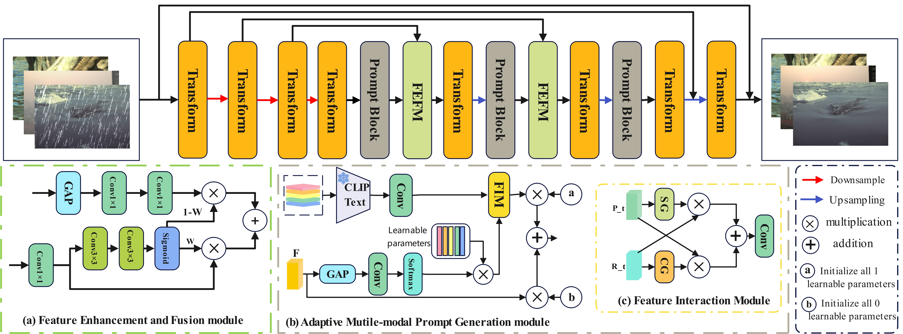
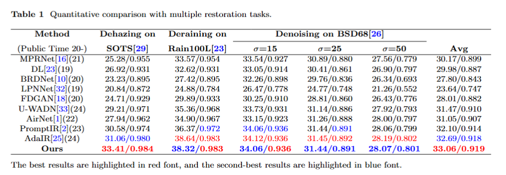
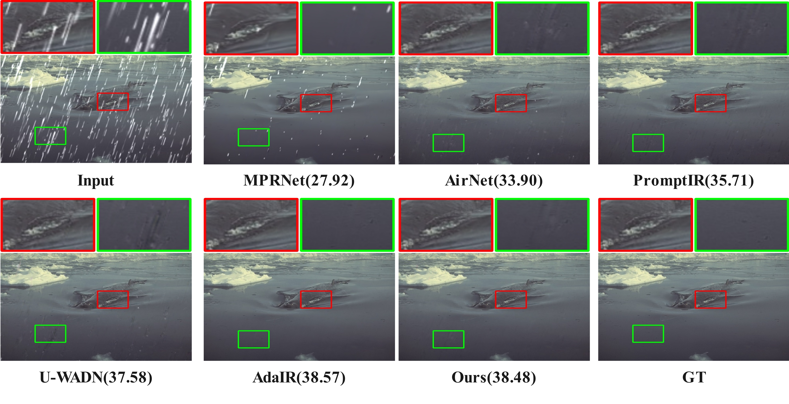

# Adaptive Multi-modal Prompting for All-in-One Image Restoration Amidst Diverse Degradations


<hr />

> **Abstract:** *The field of image restoration aims to recover high-quality images from their degraded counterparts, encompassing tasks such as denoising, deraining, and dehazing. In real-world scenarios, images often suffer from complex and diverse degradations, posing significant challenges for existing restoration models. To address this, we propose AM-PromptIR, an adaptive multi-modal image restoration framework that leverages implicit relationships between diverse degradation types to guide the restoration process. Specifically, we propose an Adaptive Multi-modal Prompt Generation (AMPG) module that leverages a pre-trained language-image model to capture the implicit relationships between various degradation types. By refining these relationships and dynamically adjusting the attention distribution of image features, AMPG enhances the model's understanding of the intricate interplay between images and their degradation patterns. Additionally, we introduce a Simplified Mixed Attention Mechanism (SMAM) and a Feature Enhancement and Fusion Module (FEFM) to improve feature extraction and fusion, respectively. The experimental results showed that compared with the baseline model PromptIr, AM-PromptIR improved PSNR by 9.2% in dehazing  tasks, 5.3% in deraining operations, and an average PSNR increase of 3.0% in various degraded tasks.These findings highlight the robustness and effectiveness of our approach in handling diverse image degradations.* 
<hr />

## Network Architecture

 

## Installation and Data Preparation

See [INSTALL.md](INSTALL.md) for the installation of dependencies and dataset preperation required to run this codebase.

## Training

After preparing the training data in ```data/``` directory, use 
```
python train.py
```
to start the training of the model. Use the ```de_type``` argument to choose the combination of degradation types to train on. By default it is set to all the 3 degradation types (noise, rain, and haze).

Example Usage: If we only want to train on deraining :
```
python train.py --de_type derain
```

## Testing

After preparing the testing data in ```test/``` directory, place the mode checkpoint file in the ```ckpt``` directory.  To perform the evalaution use
```
python test.py --mode {n}
```
```n``` is a number that can be used to set the tasks to be evaluated on, 0 for denoising, 1 for deraining, 2 for dehaazing and 3 for all-in-one setting.

Example Usage: To test on all the degradation types at once, run:

```
python test.py --mode 3
```

## Results
Performance results of the AM-PromptIR framework trained under the all-in-one setting

<summary><strong>Table</strong> </summary>

 

<summary><strong>Visual Results</strong></summary>
 
 


## Contact
**Acknowledgment:** This code is based on the [AirNet](https://github.com/XLearning-SCU/2022-CVPR-AirNet) and [PromptIR](https://github.com/va1shn9v/PromptIR) repositories. 

