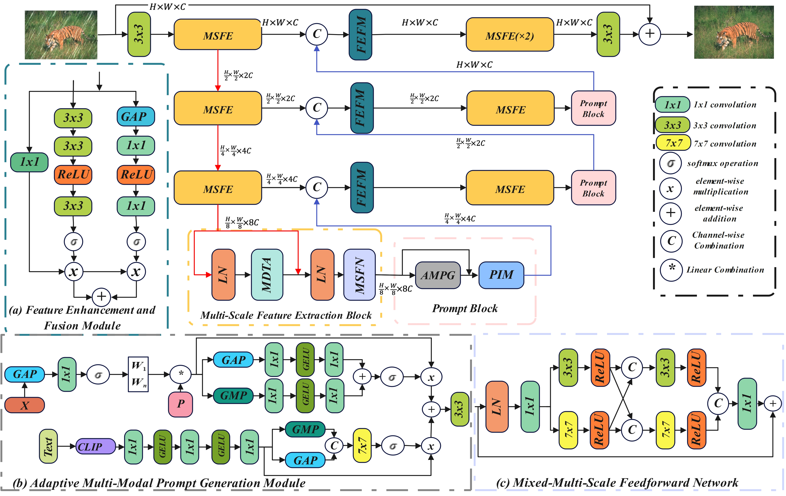

# AM-PromptIR:Adaptive Multi-Prompt Information-Guided Multi-Scale All-in-One Image Restoration


<hr />

> **Abstract:** *The goal of All-in-One image restoration is to use a single model to address
various degradation types like noise, haze, blur, and rain streaks in low-quality
images, producing high-quality outputs. While existing models perform well, they
either rely solely on visual information or handle visual and semantic data sepa-
rately, limiting their adaptability. To overcome this, we introduce AM-PromptIR,
an adaptive multimodal prompt learning approach. It features an Adaptive Mul-
timodal Prompt Generation module, dynamically adjusting prompts for different
degradation types. Additionally, the Multi-Scale Feature Extraction and Fea-
ture Enhancement and Fusion module capture multi-level features and optimize
feature fusion. Experimental results show that AM-PromptIR improves PSNR
by 5.5% in image dehazing, 4.0% in image deraining, and achieves at least a
1.0% PSNR increase in image denoising across various noise levels, demonstrat-
ing its robustness in tackling multiple degradation issues.* 
<hr />

## Network Architecture

 

## Installation and Data Preparation

See [INSTALL.md](INSTALL.md) for the installation of dependencies and dataset preperation required to run this codebase.

## Training

After preparing the training data in ```data/``` directory, use 
```
python train.py
```
to start the training of the model. Use the ```de_type``` argument to choose the combination of degradation types to train on. By default it is set to all the 3 degradation types (noise, rain, and haze).

Example Usage: If we only want to train on deraining :
```
python train.py --de_type derain
```

## Testing

After preparing the testing data in ```test/``` directory, place the mode checkpoint file in the ```ckpt``` directory.  To perform the evalaution use
```
python test.py --mode {n}
```
```n``` is a number that can be used to set the tasks to be evaluated on, 0 for denoising, 1 for deraining, 2 for dehaazing and 3 for all-in-one setting.

Example Usage: To test on all the degradation types at once, run:

```
python test.py --mode 3
```

## Results
Performance results of the AM-PromptIR framework trained under the all-in-one setting

<summary><strong>Table</strong> </summary>

 

<summary><strong>Visual Results</strong></summary>

The visual results of the PromptIR model evaluated under the all-in-one setting can be downloaded [here]().


## Contact
**Acknowledgment:** This code is based on the [AirNet](https://github.com/XLearning-SCU/2022-CVPR-AirNet) and [PromptIR](https://github.com/va1shn9v/PromptIR) repositories. 

